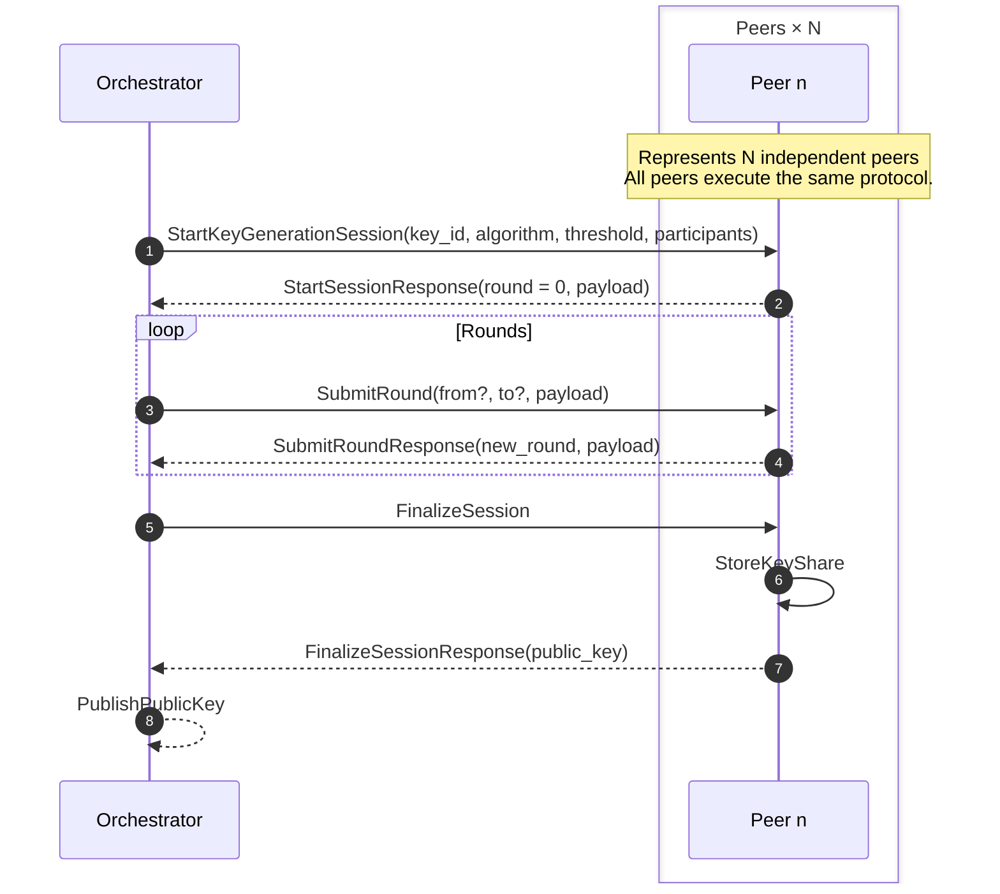
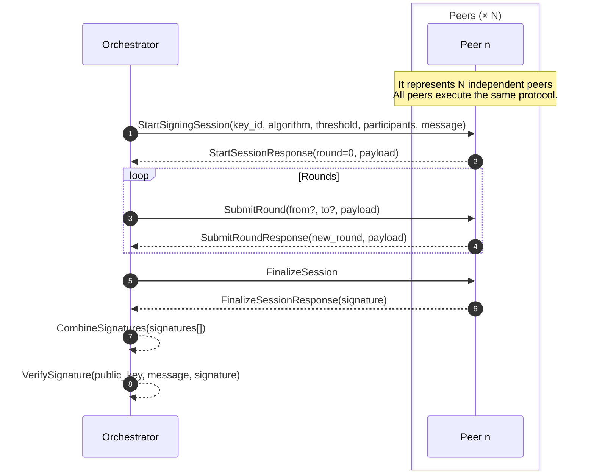

# Multi-Party Computation Engine

This document describes the setup and prerequisites for the Multi-Party Computation (MPC) Engine.
This engine is designed to securely manage key shares and perform signing operations in a distributed manner.

## Compatibility

| OS                 | Status |
| ------------------ | ------ |
| macOS              | ✅     |
| Linux              | ✅     |
| Windows (via WSL2) | ✅     |
| Native Windows     | ✅     |

## Prerequisites

- [Docker](https://www.docker.com) and Docker Compose
- [Act](https://github.com/nektos/act) for local GitHub Actions testing
- [Rust](https://www.rust-lang.org) and Cargo

## Key Generation Protocol Overview

The following sequence diagram illustrates the interactions between the orchestrator and multiple peers during a key generation session using the MPC Engine.

The orchestrator coordinates the session, managing rounds of communication and finalizing the key generation. Each peer operates independently, executing the same protocol steps to collaboratively generate a key share.

## Signing Protocol Overview

The following sequence diagram illustrates the interactions between the orchestrator and multiple peers during a signing session using the MPC Engine.

Each peer operates independently, executing the same protocol steps to collaboratively generate a signature. The orchestrator coordinates the session, managing rounds of communication and finalizing the signature.

