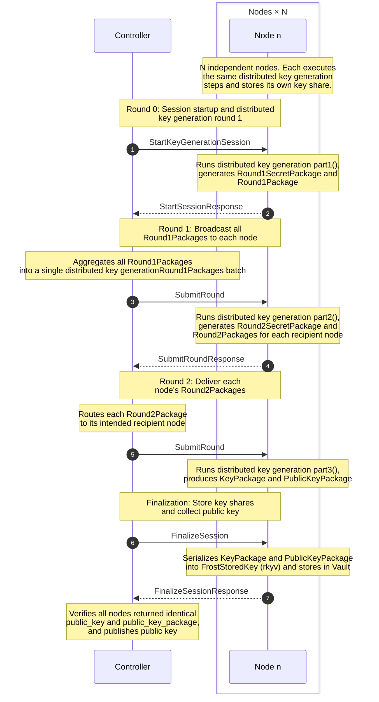
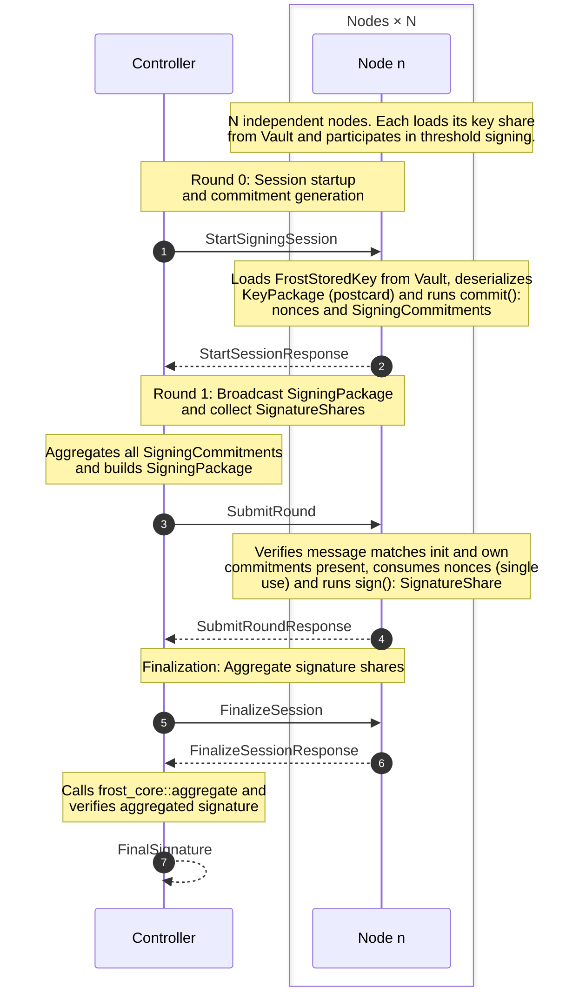
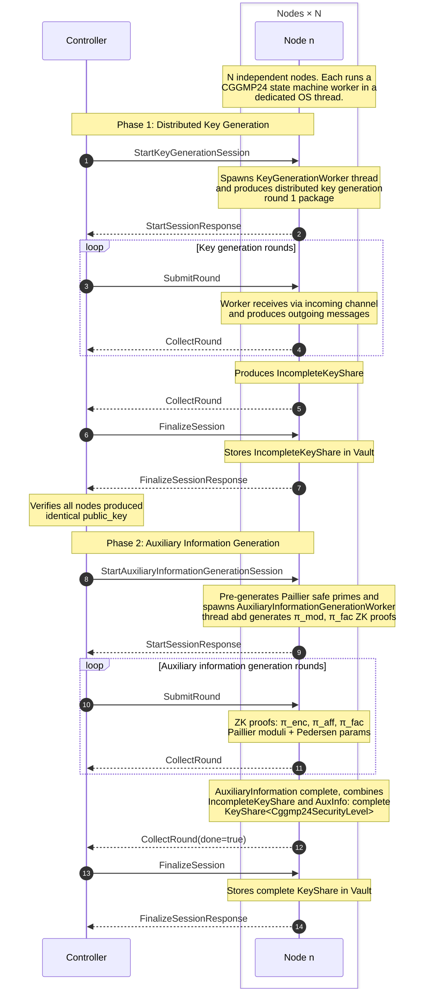
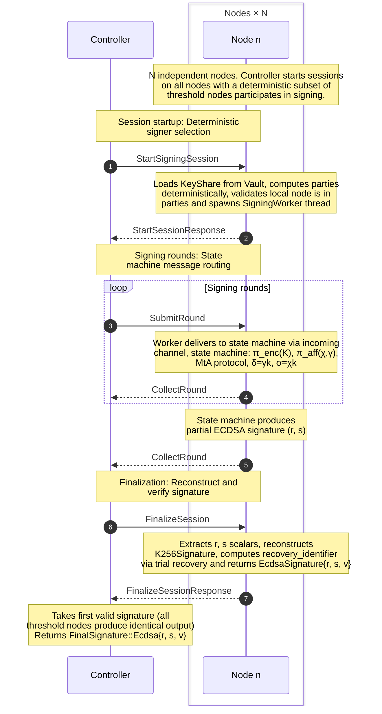

# Multi-Party Computation Cryptographic Engine

This document outlines the setup and prerequisites for the multi-party computation cryptographic engine, a distributed system responsible for secure key generation and threshold signing using protocols such as FROST and CGGMP24. The engine coordinates multiple nodes to manage key shares, execute cryptographic state machines, and produce signatures without ever reconstructing private keys.

## Compatibility

| OS                 | Status |
| ------------------ | ------ |
| macOS              | ✅     |
| Linux              | ✅     |
| Windows (via WSL2) | ✅     |
| Native Windows     | ✅     |

## Prerequisites

- [Docker](https://www.docker.com) and Docker Compose
- [Act](https://github.com/nektos/act) for local GitHub Actions testing
- [Rust](https://www.rust-lang.org) and Cargo

## Key Generation Protocols

## FROST Key Generation Protocol

The following sequence diagram illustrates the interactions between the controller and multiple nodes during a FROST distributed key generation session.

The controller coordinates the session across three rounds, routing packages between nodes. Each node independently executes the same distributed key generation steps and stores its own key share in Vault.

## FROST Signing Protocol

The following sequence diagram illustrates the interactions between the controller and multiple nodes during a FROST threshold signing session.

The controller aggregates commitments from all nodes, builds the signing package, and collects signature shares. Each node independently verifies the message and produces a signature share using its key share.

## CGGMP24 Key Generation Protocol

The following sequence diagram illustrates the interactions between the controller and multiple nodes during a CGGMP24 key generation session, comprising two phases: distributed key generation and auxiliary information generation.

Each node runs a dedicated worker thread executing the CGGMP24 state machine. The controller routes messages between nodes across all rounds and finalizes each phase independently.

## CGGMP24 Signing Protocol

The following sequence diagram illustrates the interactions between the controller and multiple nodes during a CGGMP24 threshold signing session.

The controller starts sessions on all nodes. Each node independently derives the same deterministic signer subset from the key identifier. The CGGMP24 state machine executes the MtA protocol across multiple rounds to produce a threshold ECDSA signature.

